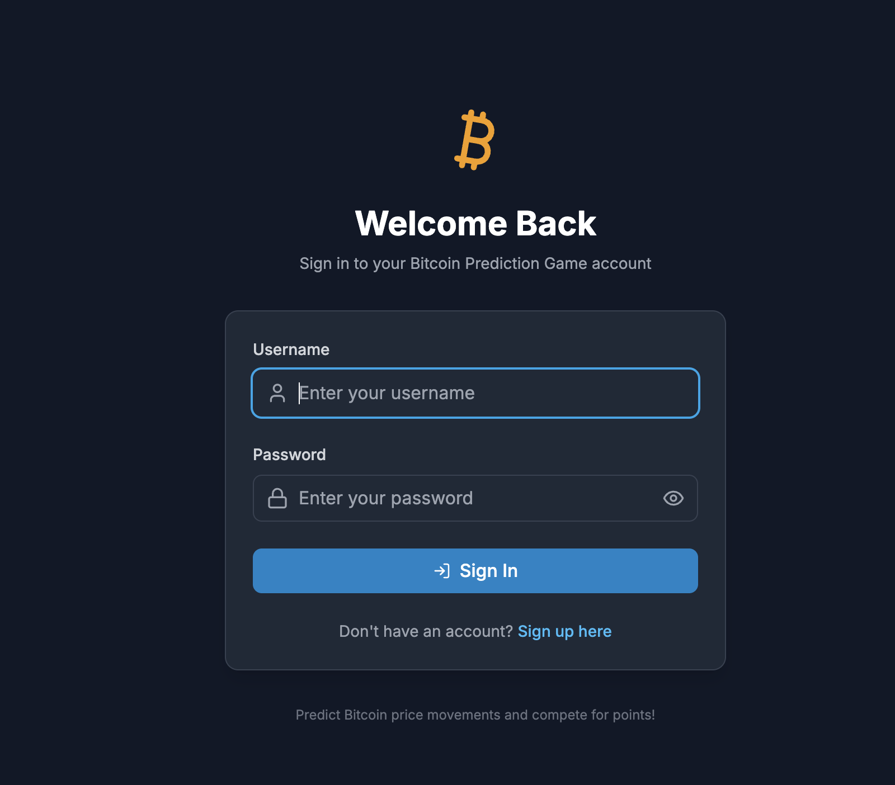
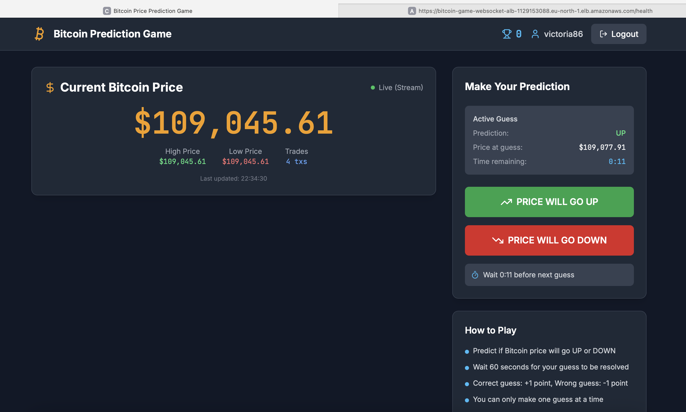
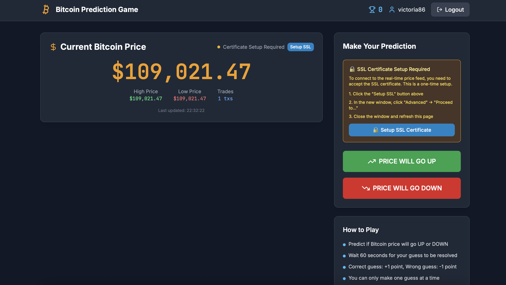

# Bitcoin Price Prediction Game

A real-time Bitcoin price prediction game built with modern serverless architecture on AWS. Players register, make predictions on Bitcoin price movements, and compete for points based on accuracy.

## 🎮 Game Overview

> **Note**: Experience the live game at: https://d3nu3xfyi43erv.cloudfront.net/login

**How to Play:**
1. **Register and login** to create your account
2. **View current Bitcoin price** from Binance in real-time
3. **Make UP/DOWN predictions** on price movements
4. **Wait 60 seconds** for your prediction to resolve
5. **Earn points**: +1 for correct predictions, -1 for incorrect
6. **Compete with others** to achieve the highest score

### 📱 Application Interface

**User Registration & Login**


*Create your account and sign in with username/password validation*

**Game Interface**

*Real-time Bitcoin price display with prediction buttons and scoring system*

**Initial Setup (One-time)**

*SSL certificate setup for secure real-time updates (required for ALB self-signed certificate)*

## 🏗️ Architecture

```
┌─────────────────┐    ┌─────────────────┐    ┌─────────────────┐
│   Frontend      │    │   API Gateway   │    │   Lambda        │
│   (React SPA)   │◄──►│   (REST API)    │◄──►│   Functions     │
│   CloudFront    │    │                 │    │                 │
│   S3            │    │                 │    │                 │
└─────────────────┘    └─────────────────┘    └─────────────────┘
         │                                             │
         │                                             ▼
         │                                    ┌─────────────────┐
         │                                    │   DynamoDB      │
         │                                    │   (User Data)   │
         │                                    └─────────────────┘
         │                                             │
         ▼                                             ▼
┌─────────────────┐    ┌─────────────────┐    ┌─────────────────┐
│   ALB           │    │   WebSocket     │◄──►│   ElastiCache   │
│   (Load         │◄──►│   Service       │    │   (Redis)       │
│   Balancer)     │    │   (ECS Fargate) │    │   (Cache/Queue) │
└─────────────────┘    └─────────────────┘    └─────────────────┘
                                │                       
                                ▼                       
                       ┌─────────────────┐              
                       │   Binance API   │              
                       │   (WebSocket)   │              
                       │   (Price Data)  │              
                       └─────────────────┘              
                                                        
                                              
```

### Technology Stack

**Frontend:**
- React 18 with functional components and hooks
- TailwindCSS for responsive styling
- React Router for navigation
- Axios for API communication

**Backend:**
- AWS Lambda functions (Node.js 18.x)
- API Gateway for REST endpoints
- DynamoDB for user data and scores
- ElastiCache (Redis) for session management

**Real-time Services:**
- WebSocket service on ECS Fargate
- Binance WebSocket API for live price data
- Server-Sent Events (SSE) with JWT authentication for browser updates

**Infrastructure:**
- Terraform for Infrastructure as Code
- VPC with public/private subnets and NAT Gateway
- Internet Gateway and Route Tables
- Security Groups for network isolation
- CloudFront CDN + S3 for frontend hosting
- ECR for container registry
- Application Load Balancer (ALB) with SSL/TLS
- ECS Fargate cluster for containerized services
- CloudWatch for logging and monitoring
- IAM roles and policies for security

## 🚀 Quick Start

### Prerequisites

- **AWS CLI** configured with appropriate permissions
- **Terraform** (>= 1.0)
- **Docker** (for WebSocket service)
- **Node.js** (>= 16) and **npm**

### One-Command Deployment

```bash
# Clone the repository
git clone <repository-url>
cd serverless-demo

# Deploy everything
./scripts/deploy.sh
```

This script will:
- ✅ Deploy AWS infrastructure (VPC, DynamoDB, ElastiCache, etc.)
- ✅ Build and deploy Lambda functions
- ✅ Build and deploy WebSocket service to ECS
- ✅ Build and deploy React frontend to S3/CloudFront

### Access Your Application

After deployment, you'll see:
```
📋 Deployment Summary:
  🌐 Website URL: https://your-cloudfront-domain.cloudfront.net
  🔌 API Gateway: https://your-api-id.execute-api.eu-north-1.amazonaws.com/prod
  📡 WebSocket Service: https://your-alb-dns-name
```

## 📁 Project Structure

```
serverless-demo/
├── README.md                 # Project overview and quick start
├── DEPLOYMENT.md            # Comprehensive deployment guide
├── TEST.md                  # Testing documentation
├── scripts/                 # Deployment and testing automation
│   ├── deploy.sh           # Main deployment script
│   ├── cleanup.sh          # Resource cleanup script
│   ├── test-deployed.sh    # Post-deployment testing
│   └── jest-tests/         # Jest-based test suite
├── terraform/              # Infrastructure as Code
│   ├── main.tf            # Core Terraform configuration
│   ├── lambda.tf          # Lambda and API Gateway resources
│   ├── database.tf        # DynamoDB configuration
│   ├── network.tf         # VPC and networking
│   ├── frontend.tf        # S3 and CloudFront
│   ├── websocket.tf       # ECS and container services
│   └── variables.tf       # Configuration variables
├── lambda/                 # Serverless functions
│   ├── functions/         # Individual Lambda functions
│   │   ├── user-registration/
│   │   ├── user-login/
│   │   ├── get-user-score/
│   │   ├── submit-guess/
│   │   └── get-latest-price/
│   ├── shared/           # Shared utilities and middleware
│   └── build.js         # Lambda build script
├── static/              # React frontend application
│   ├── src/
│   │   ├── components/  # React components
│   │   ├── pages/      # Application pages
│   │   ├── contexts/   # React context providers
│   │   └── services/   # API client services
│   └── public/         # Static assets
└── websocket-service/   # Real-time WebSocket service
    ├── src/
    │   ├── app.js      # Express application
    │   ├── services/   # Business logic services
    │   ├── routes/     # API route handlers
    │   └── utils/      # JWT authentication utilities
    └── Dockerfile      # Container definition
```

## 🎯 API Endpoints

### API Gateway (REST API)
| Endpoint | Method | Auth Required | Description |
|----------|--------|---------------|-------------|
| `/register` | POST | No | User registration |
| `/login` | POST | No | User authentication |
| `/user/score` | GET | Yes | Get user statistics |
| `/guess` | POST | Yes | Submit price prediction |
| `/price` | GET | Yes | Get current Bitcoin price |

### WebSocket Service (SSE)
| Endpoint | Method | Auth Required | Description |
|----------|--------|---------------|-------------|
| `/sse/price` | GET | Yes | Real-time price updates via Server-Sent Events |
| `/health` | GET | No | WebSocket service health check |

## 🔧 Development

For comprehensive deploy documentation, see **[DEPLOYMENT.md](./DEPLOYMENT.md)**.

### Selective Deployment

```bash
# Deploy only infrastructure
./scripts/deploy.sh --infrastructure-only

# Deploy only Lambda functions
./scripts/deploy.sh --lambda-only

# Deploy only WebSocket service
./scripts/deploy.sh --websocket-only

# Deploy only frontend
./scripts/deploy.sh --frontend-only
```

### Local Development

```bash
# Frontend development
cd static
npm install
npm start

# Lambda functions (no tests currently available)
cd lambda
npm install
npm run build

# WebSocket service testing
cd websocket-service
npm install
npm start
```

## 🧪 Testing

This project uses comprehensive **Jest-based testing** for end-to-end validation.

### Quick Test

```bash
# Test the deployed application
./scripts/test-deployed.sh
```

### Test Categories

- **API Validation**: Input validation and security tests
- **Business Logic**: Game rules and authentication workflows
- **Error Handling**: Resilience and error response tests
- **Real-time Features**: WebSocket and SSE functionality
- **Performance**: Load testing and response time measurement

For detailed testing documentation, see **[TEST.md](./TEST.md)**.

## 📊 Monitoring

### CloudWatch Integration

- **Lambda Logs**: `/aws/lambda/bitcoin-prediction-game-dev-*`
- **ECS Logs**: `/ecs/bitcoin-prediction-game-dev-websocket`


## 🔒 Security Features

- **JWT Authentication**: Secure token-based user sessions
- **Password Hashing**: bcrypt with salt rounds
- **VPC Isolation**: Private subnets for backend services
- **HTTPS Enforcement**: All external communications encrypted
- **IAM Roles**: Least privilege access principles
- **Input Validation**: Comprehensive request validation

## 🎮 Game Rules

1. **Registration**: Users create accounts with username/password
2. **Authentication**: JWT tokens for secure session management
3. **Predictions**: Make UP/DOWN predictions on Bitcoin price movements
4. **Resolution**: Predictions automatically resolve after 60 seconds
5. **Scoring**: +1 point for correct predictions, -1 for incorrect
6. **Limitations**: Only one active prediction per user at a time
7. **Starting Score**: New users begin with 0 points

## 🔧 Configuration

### Environment Variables

Key configuration options in `terraform/terraform.tfvars`:

```hcl
project_name          = "bitcoin-prediction-game"
environment           = "dev"
aws_region            = "eu-north-1"
jwt_secret            = "your-secret-key-change-in-production"
elasticache_node_type = "cache.t2.micro"  # Demo/dev optimized
fargate_cpu           = 256              # Minimum for demo
fargate_memory        = 512              # Minimum for demo
```

## 🆘 Troubleshooting

### Common Issues

**Deployment fails:**
```bash
# Check prerequisites
./scripts/deploy.sh --help

# Verify AWS credentials
aws sts get-caller-identity
```

**API/Lambda issues:**
- Check AWS CloudWatch logs for specific error messages
- Verify DynamoDB and Redis connectivity
- Run the test suite: `./scripts/test-deployed.sh`

**Real-time price updates not working:**
- Visit the ALB health endpoint (shown in deployment output)
- Configure SSL certificate exception in browser (see screenshot)
- Check if WebSocket service is running in ECS console


## 🧹 Cleanup

```bash
# Remove all AWS resources
./scripts/cleanup.sh

# Remove only local build artifacts
./scripts/cleanup.sh --local-only
```

**⚠️ Warning**: Complete cleanup will permanently delete all resources and data.

## 🤝 Contributing

Fork, create feature branch, commit changes, and open a Pull Request.

## 📄 License

This project is licensed under the MIT License - see the LICENSE file for details.

---

**Note**: This is a demonstration project showcasing modern serverless architecture patterns. For production use, implement additional security measures, monitoring, backup strategies, and consider AWS service quotas and limits.